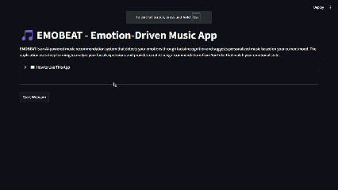

# 🎵 EMOBEAT - Emotion-Driven Music App

An AI-powered music recommendation system that detects real-time emotions through facial recognition and provides personalized music recommendations based on your current mood.

## 🎬 Demo



*Experience the full workflow: emotion detection → music discovery → playlist creation*

## 🌟 Features

- **Real-Time Emotion Detection**: Uses webcam feed to analyze facial expressions and detect emotions using deep learning models
- **Intelligent Music Recommendation**: Suggests songs aligned with detected mood, pulling music data from YouTube
- **Song Download & Playback**: Download recommended songs and play them with built-in music player
- **Professional Interface**: Clean, intuitive Streamlit-based web application
- **Multiple Emotion Support**: Detects 7 emotions - happy, sad, angry, fear, disgust, neutral, surprise

## 🛠️ Technologies Used

- **Python**: Core programming language
- **OpenCV**: Real-time webcam input and facial recognition
- **TensorFlow/Keras**: Deep learning emotion detection model
- **YouTube API & yt-dlp**: Search, fetch, and download songs from YouTube
- **Streamlit**: Web application framework for user interface
- **Google API Client**: YouTube Data API integration

## 📋 Prerequisites

- Python 3.7+
- Webcam/Camera access
- Internet connection for YouTube API
- YouTube Data API key

## 🚀 Installation

1. **Clone the repository**
   ```bash
   git clone https://github.com/Saad-Shakeel/Emotion-Driven-Music-App.git
   cd Emotion-Driven-Music-App
   ```

2. **Install dependencies**
   ```bash
   pip install uv
   uv sync
   ```

3. **Install FFmpeg**
   - Download FFmpeg from: https://www.gyan.dev/ffmpeg/builds/ffmpeg-release-essentials.zip
   - Extract the zip file
   - Add the `bin` folder path to your system environment variables

4. **Set up YouTube API**
   - Get YouTube Data API key from [Google Cloud Console](https://console.cloud.google.com/)
   - Create `.env` file in project root
   - Add your API key:
     ```
     YOUTUBE_API_KEY=your_api_key_here
     ```

5. **Download emotion detection model**
   - Ensure `emotionDetection.json` and `emotionDetection.h5` files are in the project directory

## 🎯 Usage

1. **Run the application**
   ```bash
   streamlit run main.py
   ```

2. **Follow the app workflow**
   - **Step 1**: Click "Start Webcam" to activate emotion detection
   - **Step 2**: Position your face in front of camera
   - **Step 3**: Click "Detect Mood" when ready
   - **Step 4**: Select mood filter and music genre
   - **Step 5**: Browse and download recommended songs
   - **Step 6**: Enjoy your personalized playlist

## 🎵 Music Genres

- Pop
- Rock
- Hip-Hop/Rap
- Electronic
- Classical
- Bollywood
- Punjabi
- Sufi

## ⚙️ Configuration

### Environment Variables
Create a `.env` file with:
```
YOUTUBE_API_KEY=your_youtube_api_key
```

### Model Files
Ensure these files are present:
- `emotionDetection.json` - Model architecture
- `emotionDetection.h5` - Trained weights

---

⭐ **Star this repository if you found it helpful!**